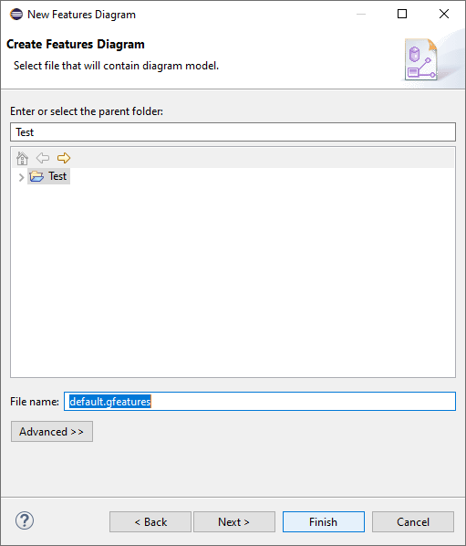

# Cardinality-based Feature Modeling Tools

This repository contains a metamodel and a set of editors to create cardinality-based feature models with attributes.
It also supports some additional relationships sucha as _Implies_, _Excludes_, and _Use_.

This is an up-to-date version of a prototype built in 2010 during my PhD thesis.
The metamodel and the followed approach were presented in ([archived author's version](https://abel.gomez.llana.me/wp-content/uploads/2017/11/gomez-isd-2010.pdf)): 

> Abel Gómez, Isidro Ramos. _Automatic Tool Support for Cardinality-Based Feature Modeling with Model Constraints for Information Systems Development_. Information Systems Development: Business Systems and Services: Modeling and Development, Springer New York, New York, NY, 2011, ISBN: 978-1-4419-9790-6, (Prague, Czech Republic). doi:10.1007/978-1-4419-9790-6_22

Additional details are also provided in chapters 6 and 7 of [my PhD thesis](http://hdl.handle.net/10251/15075).

Currently, the prototype does not include the functionality able to generate a _Domain Variability Model_ from a cardinality-based feature model due to the lack of a working QVT-Relation transformations engine. A rework of the transformation in QVTo or Xtend is planned (without a specific roadmap).

# Installation

Install the prototype by using the following Update site:

> https://abelgomez.github.io/cb-feature-modeling/updates/

# Create a new model

The editor contributes a wizard to create new models under the _Feature Modeling_ category. Note that a project (a generic project suffices) must be created first.

# The editor

The following screenshot shows what the editor looks like.

The Car model shown in the screenshot can be found in the [`examples/Car`](examples/Car) directory.